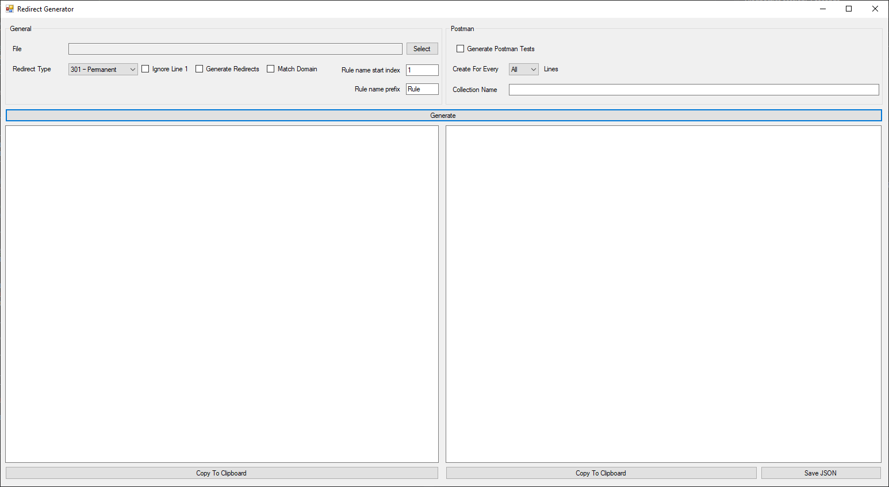

# iis-redirect-generator

The tool is designed for the easy creation of IIS redirects and postman tests. 

For IIS rewrite's I recommend using https://github.com/Bikeman868/UrlRewrite.Net which supports the same redirects as the standard IIS Rewrite modules. It does not have the limitation imposed with large .config files which causes issues when you have a large number of redirects and can't be fixed in Azure WebApps.

The application loads .csv files that are expected to be formatted in 2 columns sich as the following attached file [Redirect Example](docs/Book1.csv).
